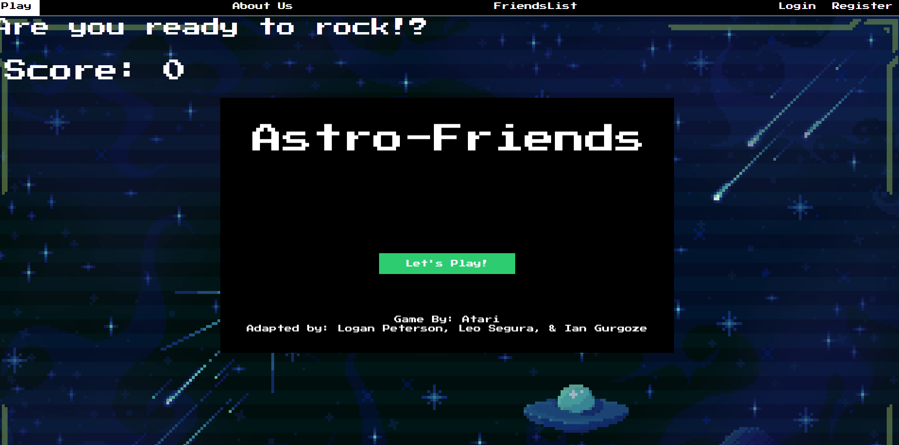
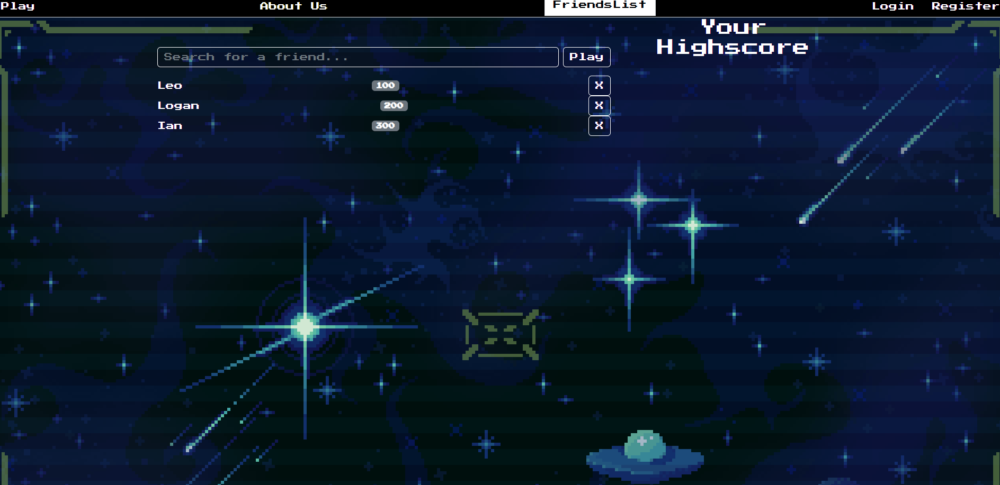
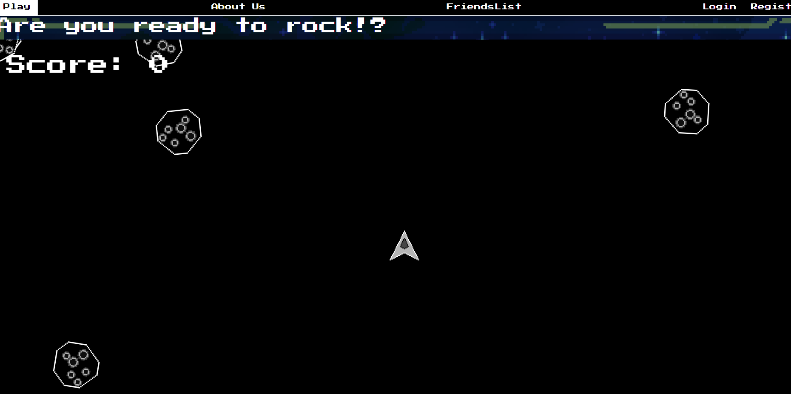

# Astro-Friends

## Description
Retro Asteroids playable on your machine or mobile device. Using ReactJS you can log in and play , see your highscores, and your friends highscore. 

## Table of contents

- [Installation](#Insallation)

- [Usage](#Usage)

- [Contribution](#Contributing)

- [Test](#Test)

- [Questions](#Questions)

## Installation

run 'npm install' on your local machine to required all needed packages.

## Usage
Hit the play to start playing or browse through the tabs. Friendslist to see your score, login or create your account in the register tab.

[Deployed Version]()

## Contributing
[Leo Segura](https://github.com/lsegura06) 

[Ian Gurgoze](https://github.com/igurgoze) 

[Logan Peterson](https://github.com/codeDevLogan)

## Test

## Questions
Feel Free to ask any questions to the contributors above.

GitHub Username: 

Email Address: 